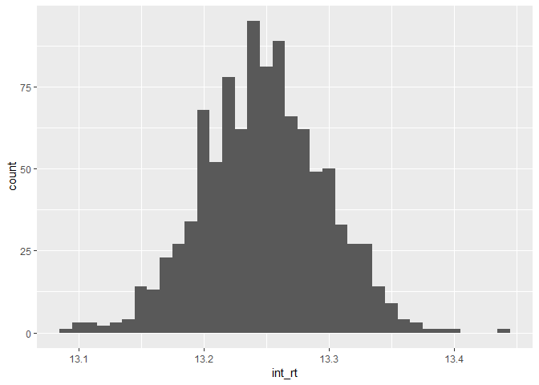

Loanbuilder EDA
================
Drey Upsher-Obear
November 15, 2018

Setup & Data
------------

These packages will be required for this EDA.

``` r
library(devtools)
library(tidyverse)
```

    ## -- Attaching packages ---------------------------------- tidyverse 1.2.1 --

    ## v ggplot2 3.1.0     v purrr   0.2.5
    ## v tibble  1.4.2     v dplyr   0.7.8
    ## v tidyr   0.8.2     v stringr 1.3.1
    ## v readr   1.1.1     v forcats 0.3.0

    ## -- Conflicts ------------------------------------- tidyverse_conflicts() --
    ## x dplyr::filter() masks stats::filter()
    ## x dplyr::lag()    masks stats::lag()

``` r
library(RCurl)
```

    ## Loading required package: bitops

    ## 
    ## Attaching package: 'RCurl'

    ## The following object is masked from 'package:tidyr':
    ## 
    ##     complete

``` r
library(statsr)
```

    ## Loading required package: BayesFactor

    ## Loading required package: coda

    ## Loading required package: Matrix

    ## 
    ## Attaching package: 'Matrix'

    ## The following object is masked from 'package:tidyr':
    ## 
    ##     expand

    ## ************
    ## Welcome to BayesFactor 0.9.12-4.2. If you have questions, please contact Richard Morey (richarddmorey@gmail.com).
    ## 
    ## Type BFManual() to open the manual.
    ## ************

``` r
library(rmarkdown)
```

Now load the data from the .csv file.

``` r
loans <- read.csv("loan.csv", header = TRUE, sep = ",")
```

Optional: load .csv from web directly.

``` r
download <- getURL("https://www.kaggle.com/wendykan/lending-club-loan-data")

data <- read.csv(text = download)
```

Now we can start to clean and organize our data.

First, lets check our variables for this question (int\_rate, funded\_amnt) to see if it is a normal distribution.

``` r
loans %>%
  ggplot(aes(x = int_rate)) + geom_histogram(binwidth = .75)
```


Right off the bat, the interest rates seem to be fairly normal, with a notion of bimodal distribution with a right tail. It might be helpful to see some basic summary statistics for this data.

Summary Statistics
==================

``` r
loans %>%
  summarise(m = mean(int_rate), med = median(int_rate),
            sigma = sd(int_rate), pop_iqr = IQR(int_rate),
            pop_max = max(int_rate), pop_min = min(int_rate),
            pop_q1 = quantile(int_rate, .25), # 25% percentile
            pop_q3 = quantile(int_rate, .75)) # 75% percentile 
```

    ##          m   med    sigma pop_iqr pop_max pop_min pop_q1 pop_q3
    ## 1 13.24674 12.99 4.381867    6.21   28.99    5.32   9.99   16.2

Lets take some samples and see how they compare to the population. Our next step is to create a sampling distribution to find a point estimate. Creating a sample distribution also helps us determine variability when we are estimating the population mean.

``` r
sample_means.001 <- loans %>%
  rep_sample_n(size = 8000, reps = 1000, replace = TRUE) %>%
  summarise(int_rt = mean(int_rate), loan_amt = mean(loan_amnt), inst_amt = mean(installment))

ggplot(data = sample_means.001, aes(x = int_rt)) + geom_histogram(binwidth = .01)
```



This is looking good. The point estimate based on this sample distribution looks very close to the actual mean of interest rates. Based on the graph, I would estimate the mean (if I didnt already know) to be about 13.25 (pop avg: 13.246).

The reason we use the sampling distribution is because it is an unbiased, causing it to show the true mean. Ideally we should complete our point estimate inference by calculating the confidence level.

sqrt(4.38^2) / 1000 = .14 (this is the standard error) &gt; 95% CI \[12.96, 13.51\], this translates to 'we are 95% confident the population mean is between 12.96 and 13.51.

What I have gathered from this is the following;

1.  While sample means only provide an estimate, the sizes of these samples are usually easier to work with than the population as a whole.

2.  Point estimation of the mean becomes more accurate as the \# of observations in the sample increases.

Question 1
----------

Can we associate the amount of the loan with its given grade? Can we deem this causation or correlation?

First lets clean and organize our data. Lets calculate the basic stats summary, and lets put in a 95% confidence interval for graphing purposes.

``` r
amgr <- loans %>%
  group_by(grade) %>%
  summarise(m = mean(funded_amnt), s_d = sd(funded_amnt),
            ymax = max(funded_amnt), ymin = min(funded_amnt),
            y_IQR = IQR(funded_amnt), n.fund = n()) %>%
  mutate(se.fund = s_d / sqrt(n.fund),
         lower.ci = m - qt(1 - (.05 / 2), n.fund - 1) * se.fund,
         upper.ci = m + qt(1 - (.05 / 2), n.fund -1) * se.fund)
```

We will plot this with an error bar, in order to utilize the previous calculation of the confidence interval.

``` r
amgr %>%
  ggplot(aes(x = grade, y = m)) + geom_errorbar(aes(ymin = m - se.fund, ymax = m + se.fund), width = 1) +
  geom_line() +
  geom_point()+
  xlab("Grade of Loan") +
  ylab("Average Loan amount")
```

    ## geom_path: Each group consists of only one observation. Do you need to
    ## adjust the group aesthetic?


An interesting observation arises; as the loan amount increases, the grade seems to diminish. In other words, the larger the loan, the worse the grade (or so it appears).
